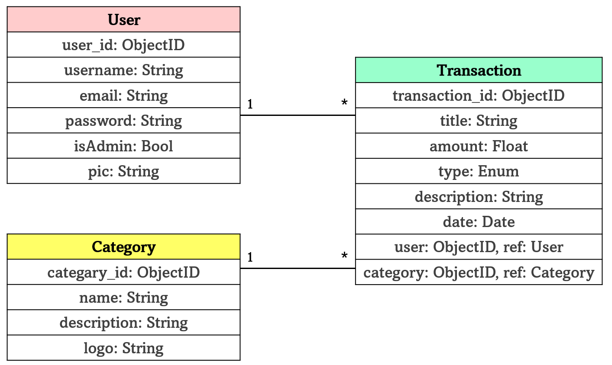
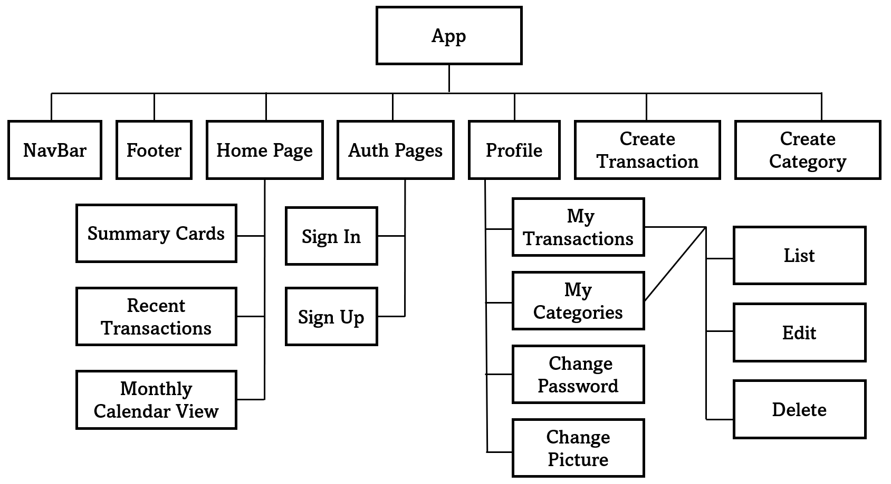

# 💸 GA Project 3: BudgetWise

## 📌 Summary
BudgetWise is a Personal Budget Tracker that helps users manage their income and expenses by tracking transactions, categorizing them, and providing an overview of financial behavior. The system supports adding, editing, and viewing transactions and helps users stay in control of their budgets.

**Collaborators:**
- Ahmed Alaali  
- Israa Alwedaei  
- Mohamed Alhamry

**🔗 Browse it live:**  
Go Live: [Deployed Personal Budget Tracker Frontend]()

**✅ Trello Board**  
Track our development progress and task assignments via our Trello board:  
🔗 [Trello Board](https://trello.com/b/jLpUqdXv/personal-budget-tracker)

---

## 🗂️ ERD of the System Models  

📌 *This diagram shows the data models and their relationships (e.g., User, Transaction, and Category)*

---

## 🧩 Component Hierarchy Diagram  

📌 *This diagram illustrates the structure of React components in the front-end.*

---

## 🖼️ Wireframes of the System  
### Home Page 

📌 *Home page of Personal Budget Tracker welcoming users and providing navigation options.*

### Sign In Page
  
📌 *Sign in page where existing users can log into their accounts.*

### Profile Page
  
📌 *Manage your transactions, categories, password, and profile picture.*

---

## 🧪 Screenshots from Browser  
### Home Page 

📌 *Home page of Personal Budget Tracker welcoming users and providing navigation options.*

### Sign In Page
  
📌 *Sign in page where existing users can log into their accounts.*

### Profile Page
  
📌 *Manage your transactions, categories, password, and profile picture.*

---

## ⚙️ Used Technologies

### Front-End:
- React.js
- React Router
- HTML
- CSS

---

## 🚀 Future Updates

Here are some planned future improvements:

- Add analytics dashboard with graphs and charts
- Multi-currency support
- Budget limit per category with warnings
- Notification system for overspending alerts

---